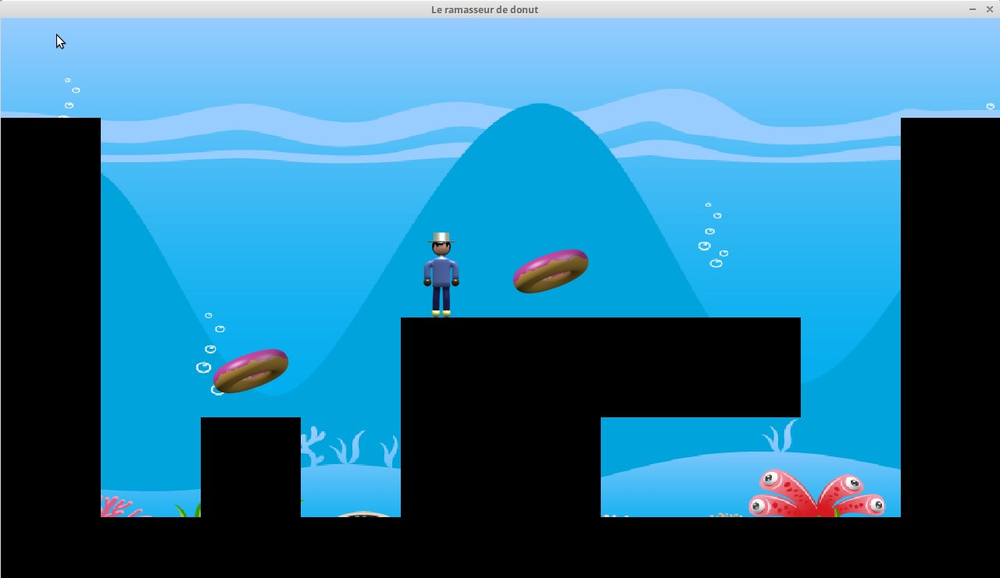

# Travail pratique 3

## Description

Ce projet consiste à créer un petit jeu dans lequel on contrôle un personnage
qui souhaite ramasser des *donuts*. Le projet est remis dans le cadre du cours
INF3135 à l'automne 2017.

## Auteur

Lukas de VIPART (DEVL17109700)

## Fonctionnement

Vous devez ramasser tous les donuts sur la carte. 

Pour ce faire vous utiliserez les touches fléchées haut/gauche/droite pour vous
déplacer.

Pour un maximum de compatibilité le jeu est au format d'écran 1280 par 720.

Vous pouvez vous même modifier vos cartes en créant un niveau du type:
~~~
0 0 0 0 0 0 0 0 0 0
1 0 0 0 0 0 0 0 0 1
1 0 0 0 0 2 0 0 0 1 
1 0 2 0 1 1 1 1 0 1 
1 0 1 0 1 1 0 0 0 1
1 1 1 1 1 1 1 1 1 1
~~~
Vous avez 10 colonnes et 6 lignes. 
~~~
0: le vide
1: le sol
2: un *donut*
~~~

exemple de map:

Pensez à nommer votre fichier `levels/level1` puisque le changement de niveau
est désactivé. 

## Plateformes supportées

Le jeu fonctionne sous Linux Mint Sonya

## Dépendances

Vous aurez besoin des bibliothèques SDL2 pour faire tourner ce programme. Plus
précisement à la console pour Ubuntu et Mint (et certainement Debian):
~~~
sudo apt-get install -y libsdl2-dev libsdl2-gfx-dev libsdl2-image-dev libsdl2-ttf-dev
~~~
Soit les librairies GFX, Image et TTF de SDL2 (en plus de la librairie standard)
https://www.libsdl.org/

## Compilation

Pour lancer le programme il suffit de faire : 
~~~
$ make
$ bin/tp3
~~~

## Références

Pour ce programme je me suis inspiré du tutoriel de `meruvia.net` sur la
création d'un jeu en SDL2 pour la gestion des fichiers.
http://www.meruvia.net/index.php/big-tuto-sdl-2-nouveau 

Le tutoriel de CS50 sur le SDL2 ainsi que de nombreux autres programmes et
tutoriel majoritairement sur YouTube et Github.
https://www.youtube.com/watch?v=yFLa3ln16w0

## Division des tâches

- [X] Programmation du menu principal 
- [X] Conception des plateformes 
- [X] Gestion des collisions 
- [X] Gestion des feuilles de sprites 

## Statut

Le projet est complété. Le code n'est pas parfaitement indenté (la barre
d'espace de mon clavier ne fonctionne plus ainsi que de nombreux boutons) et
j'ai beaucoup de mal à le faire au clavier visuel. Certaines fonctions
pourraient être rendues un peu plus propre et le code gagnerait à utiliser plus
de *getters* et de *setters*. 

Il y a peu de commentaire mais les noms des méthodes sont assez explicites. Le
saut du héro en *idle* n'est pas animé. Le jeu est de manière générale un peu
austère et il y a un petit bug sur la gravité du saut.

Le menu pourrait utiliser des boutons plutôt qu'une série d'instructions pour
un peu plus de convivialité (par exemple ajouter des niveaux et sélectionner
son niveau dans le menu). 
